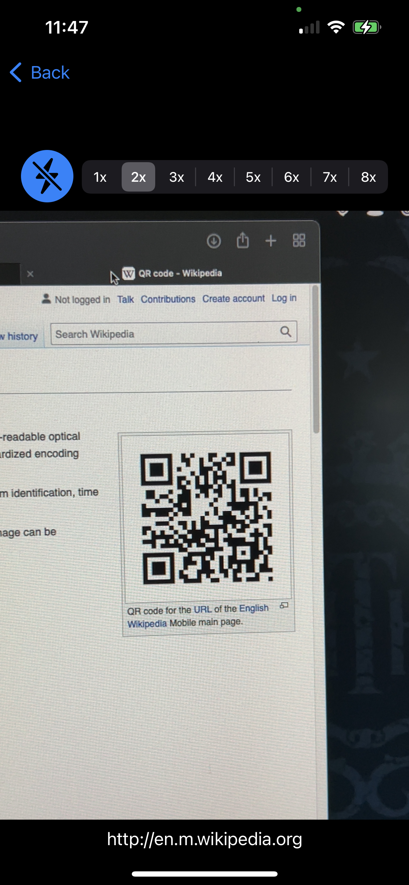

# ScanBarcodesDemo

ScanBarcodesDemo scans barcodes using an iPhone or iPad camera and displays their textual content. This demo project is a wrapper for the [ScanBarcodes](https://github.com/nasa-jpl/ScanBarcodes) Swift package for iOS.

	
	

  The barcode scanner uses [AVFoundation](https://developer.apple.com/av-foundation/) for high performance video capture and barcode recognition. There are also controls for the flashlight and the zoom level of the camera.

## Getting started

Build and run this project with an attached iPhone or iPad device using the latest version of XCode. The iOS simulator is not supported yet until camera supoprt is added to it.

### Example screen capture

## Copyright
Copyright © 2021 California Institute of Technology. ALL RIGHTS
RESERVED. United States Government Sponsorship Acknowledged.

## License

Licensed under the Apache License, Version 2.0 (the "License");
you may not use this file except in compliance with the License.
You may obtain a copy of the License at

    http://www.apache.org/licenses/LICENSE-2.0

Unless required by applicable law or agreed to in writing, software
distributed under the License is distributed on an "AS IS" BASIS,
WITHOUT WARRANTIES OR CONDITIONS OF ANY KIND, either express or implied.
See the License for the specific language governing permissions and
limitations under the License.